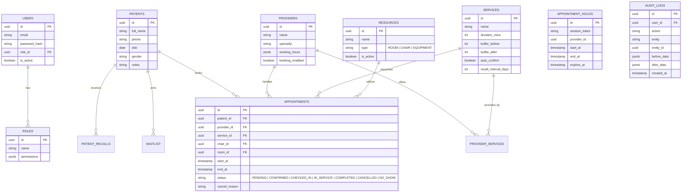

# DATABASE ERD & SCHEMA SPECIFICATION

Cơ sở dữ liệu sử dụng **PostgreSQL**. Lớp ORM sử dụng **Drizzle ORM** để đảm bảo type-safety với TypeScript.

## 1. SƠ ĐỒ THỰC THỂ QUAN HỆ (ERD)

## 2. QUY TẮC TOÀN VẸN (CONSTRAINTS & INDEXES)

- **Double Booking Prevention:**
  Sử dụng Transaction Isolation Level `SERIALIZABLE` khi Insert vào bảng `APPOINTMENTS`. Đồng thời có thể tạo Constraint loại trừ (Exclusion Constraint) trên PostgreSQL cho các trường hợp gối chồng thời gian của cùng một `provider_id` hoặc `chair_id` (Nâng cao).
  
- **Indexes:**
  - `idx_patients_phone`: Tìm kiếm nhanh bệnh nhân khi book lịch.
  - `idx_appointments_start_end`: Tìm lịch rảnh (Availability query).
  - `idx_appointments_provider`: Lọc lịch theo bác sĩ.
  - `idx_audit_logs_created`: Lọc lịch sử theo thời gian.

- **Soft Delete:**
  Các dữ liệu Master (Provider, Service, Resource) không được DELETE vật lý mà sử dụng cột `is_active = false` để tránh đứt gãy lịch sử Audit và Appointment cũ.
