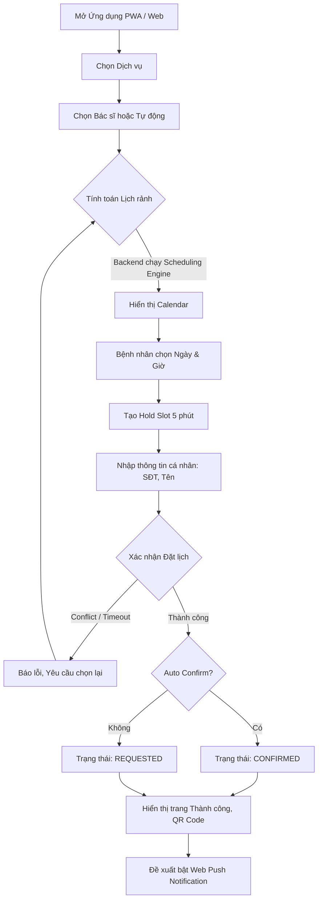
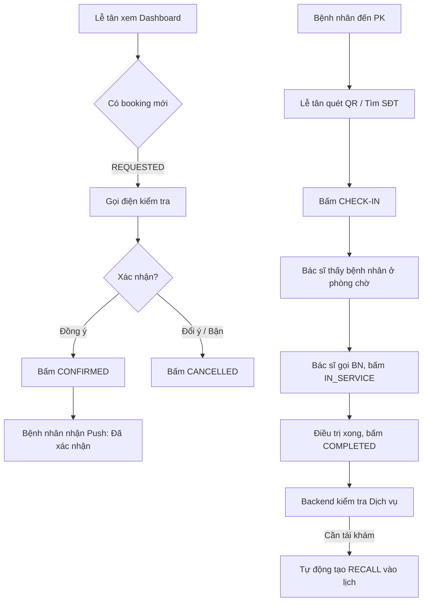
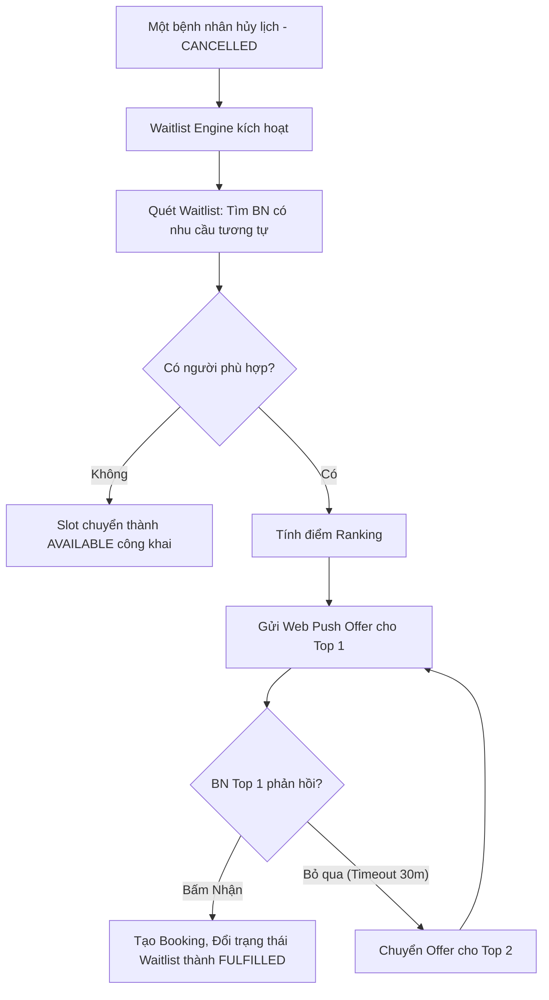

# USER FLOW (LƯU TRÌNH NGƯỜI DÙNG)

## 1. LUỒNG ĐẶT LỊCH (BỆNH NHÂN)

```mermaid
flowchart TD
    A[Mở Ứng dụng PWA / Web] --> B[Chọn Dịch vụ]
    B --> C[Chọn Bác sĩ hoặc Tự động]
    C --> D{Tính toán Lịch rảnh}
    
    D -- Backend chạy Scheduling Engine --> E[Hiển thị Calendar]
    E --> F[Bệnh nhân chọn Ngày & Giờ]
    
    F --> G[Tạo Hold Slot 5 phút]
    G --> H[Nhập thông tin cá nhân: SĐT, Tên]
    
    H --> I{Xác nhận Đặt lịch}
    
    I -- Conflict / Timeout --> J[Báo lỗi, Yêu cầu chọn lại] --> D
    
    I -- Thành công --> K{Auto Confirm?}
    
    K -- Có --> L[Trạng thái: CONFIRMED]
    K -- Không --> M[Trạng thái: REQUESTED]
    
    L --> N[Hiển thị trang Thành công, QR Code]
    M --> N
    
    N --> O[Đề xuất bật Web Push Notification]
```

## 2. LUỒNG QUẢN LÝ TẠI PHÒNG KHÁM (LỄ TÂN / BÁC SĨ)

```mermaid
flowchart TD
    A[Lễ tân xem Dashboard] --> B{Có booking mới}
    
    B -- REQUESTED --> C[Gọi điện kiểm tra]
    C --> D{Xác nhận?}
    D -- Đồng ý --> E[Bấm CONFIRMED]
    D -- Đổi ý / Bận --> F[Bấm CANCELLED]
    
    E --> G[Bệnh nhân nhận Push: Đã xác nhận]
    
    H[Bệnh nhân đến PK] --> I[Lễ tân quét QR / Tìm SĐT]
    I --> J[Bấm CHECK-IN]
    
    J --> K[Bác sĩ thấy bệnh nhân ở phòng chờ]
    K --> L[Bác sĩ gọi BN, bấm IN_SERVICE]
    
    L --> M[Điều trị xong, bấm COMPLETED]
    
    M --> N[Backend kiểm tra Dịch vụ]
    N -- Cần tái khám --> O[Tự động tạo RECALL vào lịch]
```

## 3. LUỒNG WAITLIST (KHI CÓ LỊCH HỦY)

```mermaid
flowchart TD
    A[Một bệnh nhân hủy lịch - CANCELLED] --> B[Waitlist Engine kích hoạt]
    B --> C[Quét Waitlist: Tìm BN có nhu cầu tương tự]
    
    C --> D{Có người phù hợp?}
    D -- Không --> E[Slot chuyển thành AVAILABLE công khai]
    
    D -- Có --> F[Tính điểm Ranking]
    F --> G[Gửi Web Push Offer cho Top 1]
    
    G --> H{BN Top 1 phản hồi?}
    H -- Bấm Nhận --> I[Tạo Booking, Đổi trạng thái Waitlist thành FULFILLED]
    H -- Bỏ qua (Timeout 30m) --> J[Chuyển Offer cho Top 2] --> G
```
